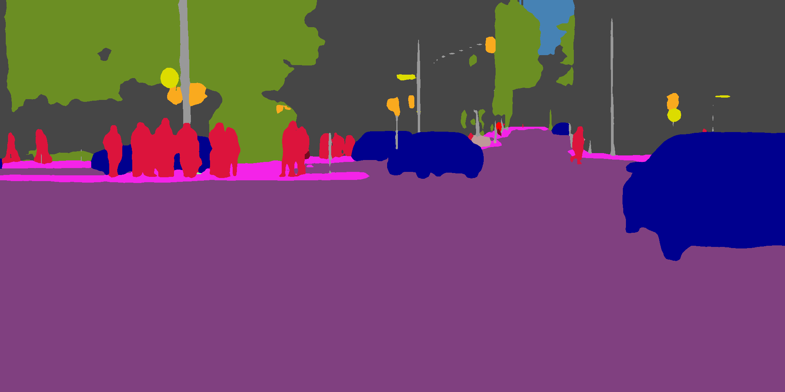
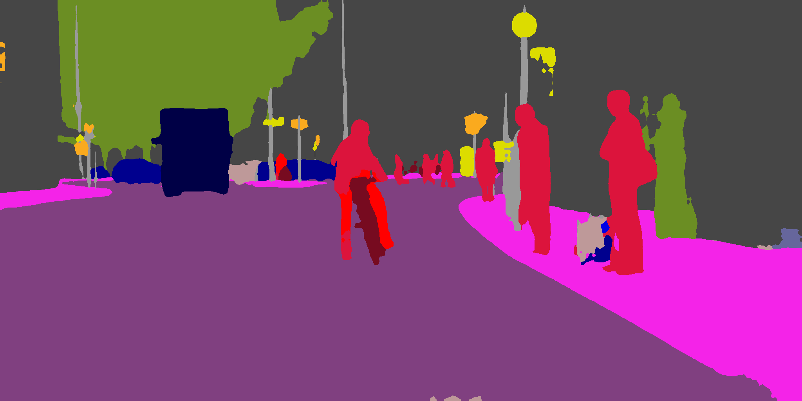
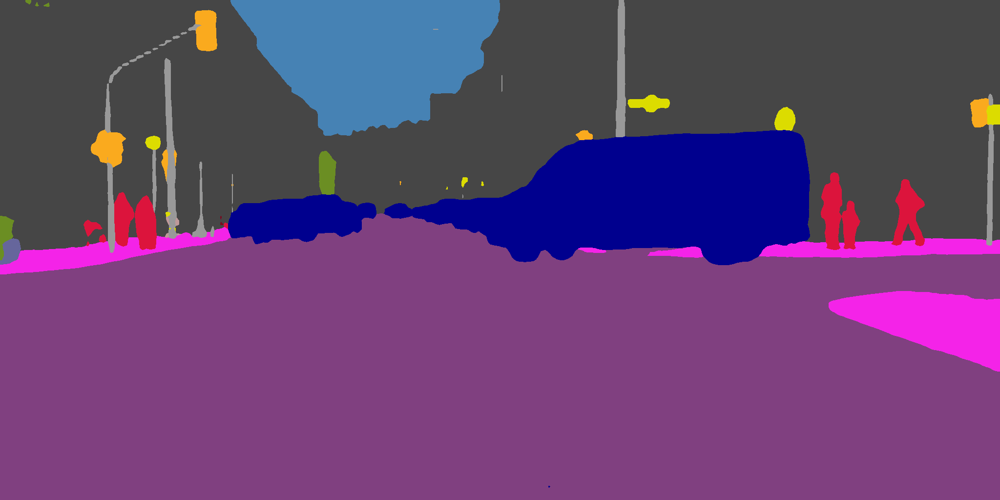

# PSPNet-Pytorch
This Repo contains an implemetation of "Pyramid Scene Parsing Network" in Pytorch. Pretrained weights are converted from Official Caffe Repo. The performance is:
[acc 0.95196], [acc_cls 0.83369], [mean_iu 0.75547], [fwavacc 0.91172]
on Validation set of CityScapes Dataset.

## Installation
1. Install Anaconda3 from [Here](https://www.anaconda.com)
2. Create a Conda Environment: 
```console
username@PC:~$ conda env create -f environment.yml
```
3. Download Cityscapes Dataset from [Here](https://www.cityscapes-dataset.com/)
4. Download Caffe Pretrained from [Here](https://drive.google.com/open?id=0BzaU285cX7TCT1M3TmNfNjlUeEU) and put it in Caffe-PSPNet folder
4. Run the code:
```console
username@PC:~$ python main.py
```


## Qualitative 
<p float="left">
  
   
  
</p>


## Note
Weight conversion from Caffe to Pytorch is modified from [pytorch-semseg](https://github.com/meetshah1995/pytorch-semseg). <br />
Preprocessing and loss function is modified from [pytorch-semantic-segmentation](https://github.com/zijundeng/pytorch-semantic-segmentation). <br />
Since the differences are significant, I decided not to add a branch to any of the the above project.
